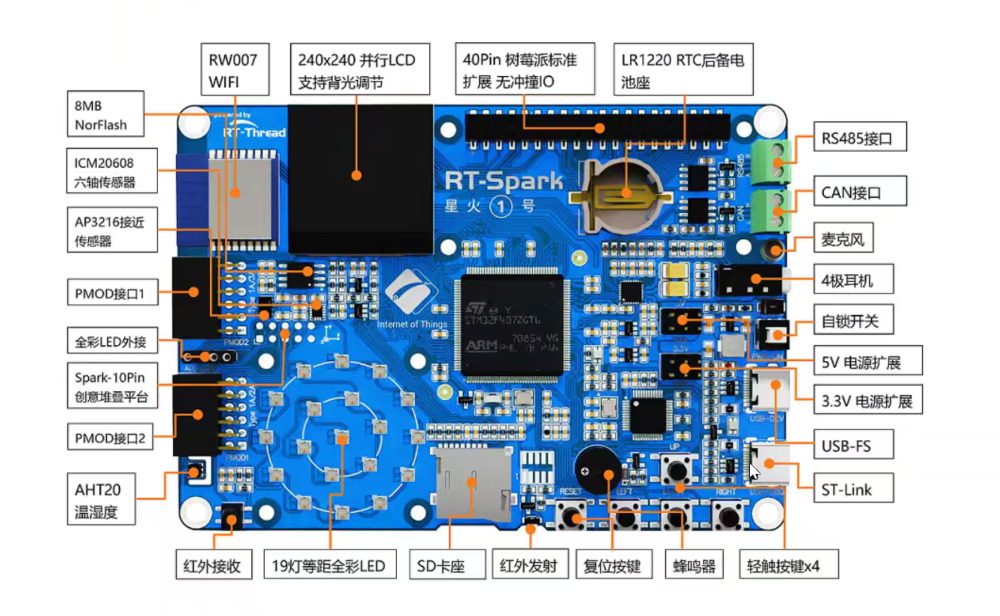

# 基于RT-Thread的智能小衣柜
## 一、功能介绍

-	LCD屏幕上实时显示衣柜内的温湿度，并实时上传到阿里云平台，可以实现远程监控
-	感应照明:利用AP3216C接近传感器来监测是否有人靠近，监测到有人靠近时，自动打开LED灯，以便于照明
-	LCD显示当前地区天气情况，且实现天气数据的联网实时更新

## 二、硬件介绍

RT-Spark 星火1号 开发板采用STM32F407作为主控制器。STM32F407 芯片是一款功能强大且高度集成的微控制器，具有灵活的可编程性和丰富的外设支持。

## 三、软件实现

1.传感器通信: 通过I2C3总线与AHT21温湿度传感器进行通信，获取实时的环境数据 
2.数据处理: 将传感器数据进行处理，提取关键信息并进行上传显示。  
3.LCD显示: 在LCD显示屏上显示信息，包括传感器数据和实时天气。.  
4..WiFi模组通信: 利用 RW007 WiFi 模组将传感器数据上传到云端界面显示。